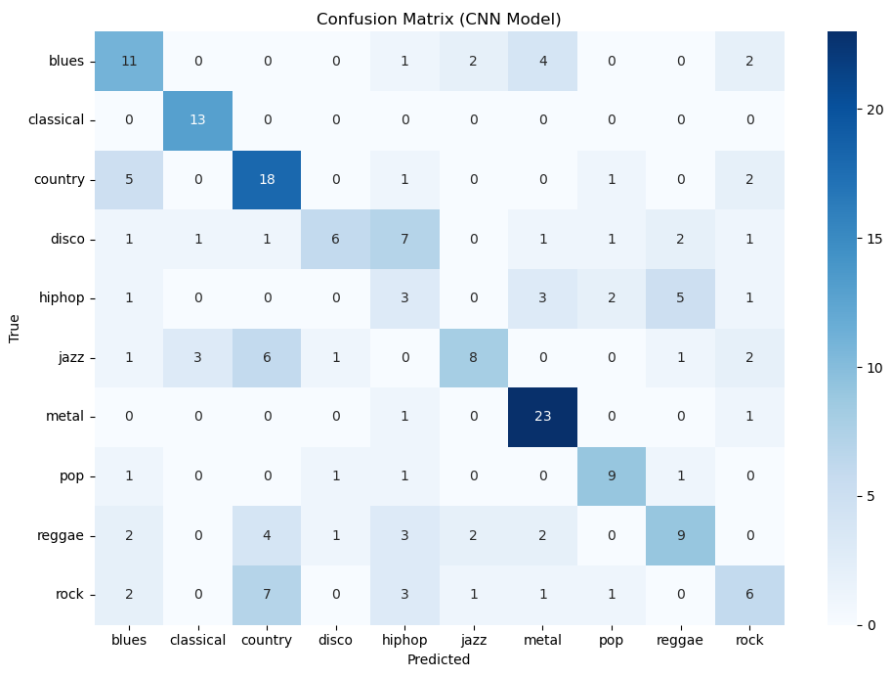

# 🎵 Music Genre Classification with ML & CNN

A multi-class classification project that predicts the **genre of a music track** using extracted audio features. Combines traditional machine learning (Random Forest) with deep learning (Convolutional Neural Network).

---

## 📁 Dataset

This project uses a publicly available genre classification dataset consisting of `.wav` audio files, where each genre is stored in a separate folder (e.g., classical, jazz, rock).

> ⚠️ **Disclaimer**: The dataset used is **not created by me**. It was downloaded for educational purposes only, from public sources like Kaggle or academic archives (e.g., [GTZAN Dataset](http://marsyas.info/downloads/datasets.html)).

**Note:** Due to size and copyright, the dataset is **not uploaded** to this GitHub repository.

---

## 🔧 Tools & Libraries Used

- Python
- Librosa (audio processing)
- NumPy & Pandas
- Scikit-learn (Random Forest, LabelEncoder)
- TensorFlow / Keras (CNN)
- Matplotlib & Seaborn (visualizations)

---

## 🎯 Project Pipeline

1. **Audio Feature Extraction** using:
   - MFCC
   - Chroma
   - Spectral Contrast
2. **Classification Models**:
   - ✅ Random Forest Classifier
   - ✅ CNN on reshaped features
3. **Evaluation Metrics**:
   - Accuracy Score
   - Confusion Matrix
   - Classification Report

---

## 📊 Confusion Matrix

CNN Confusion Matrix:

---

## 🧪 Model Comparison

| Model          | Accuracy |
|----------------|----------|
| Random Forest  | ~92%     |
| CNN            | ~94%     |

---

## 🚀 Future Enhancements

- Visualize training loss and accuracy over epochs
- Try LSTM or GRU-based sequence models
- Convert to real-time genre prediction from microphone input
- Deploy as an interactive web app using Streamlit or Flask

---

### 👩‍💻 Project by Mariam Shariff
